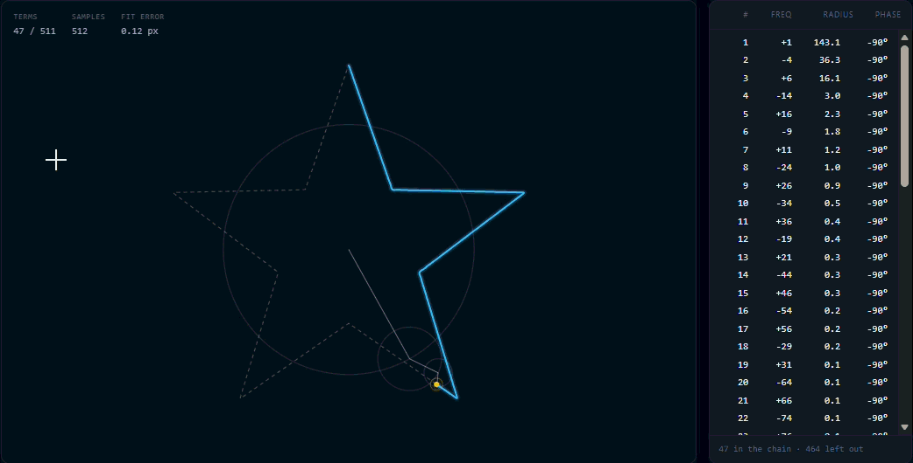

# Fourier Signature

Draw a shape. It becomes a list of complex numbers, the discrete Fourier transform turns that list
into circles, and a chain of those circles draws it back.

**[Live demo](https://USERNAME.github.io/fourier-signature/)** · no build step, no dependencies

<!-- Record a loop with the Record button in the app, convert it, and drop it in here:
     ffmpeg -i fourier-signature.webm -vf "fps=24,scale=760:-1:flags=lanczos" demo.gif -->



## How it works

A drawing is a sequence of points. Read each point `(x, y)` as the complex number `x + iy` and the
drawing becomes a single complex-valued signal — which is exactly the kind of thing the DFT eats.

```
X[n] = (1/N) · Σₖ z[k] · e^(−2πi·n·k/N)
```

Each coefficient `X[n]` is a complex number, and a complex number is a vector with a length and an
angle. Give it a rotation speed — the bin's frequency — and it is a circle. Chain the circles
tip-to-tip, spin each at its own rate, and the end of the chain retraces the original path.

Reconstruction is the inverse transform, read as a sum of rotations:

```
z(t) = Σₙ |X[n]| · e^(i(2π·fₙ·t + φₙ))
```

### The three details that actually matter

**Resample by arc length before transforming.** Pointer events fire on a clock, not on a ruler: a
fast flick lays down four points where a slow curl lays down eighty. Handed to the DFT unchanged,
that says the eighty points took twenty times longer, and the animation sprints through the flick and
crawls through the curl. Respacing the path by distance throws away the drawing's timing and keeps
only its shape. This one step is the difference between "looks broken" and "looks right".

**The upper half of the spectrum is negative.** Bin `n > N/2` is frequency `n − N`, a circle
spinning clockwise. Read bin 400 of 512 as `+400` instead of `−112` and the chain flies apart.

**Sort terms by amplitude, not frequency.** The slider adds circles biggest-first, so every step
visibly refines the shape. Sorted by frequency, the slider's first half does nothing you can see.

Frequency zero is the mean of every sample — the drawing's centroid. It does not rotate, so it is
not an epicycle; it is the fixed point the whole chain hangs from.

The transform is the naive O(N²) sum, not an FFT. At N = 512 it runs in a couple of milliseconds,
once, when you lift the pen. An FFT would buy nothing here and cost the reader the formula.

## Things to try

- **Square preset, terms slider low.** The corners overshoot and ring. That is the Gibbs phenomenon:
  a corner is a discontinuity in the derivative, and a finite sum of smooth circles cannot make one.
- **Turn off "Close loop"** with an open drawing. The path has to jump from the end back to the
  start each cycle, and the series rings at the seam for the same reason.
- **Watch the fit error** in the top-left as you drag the slider. At full terms it reads 0.00 px —
  the reconstruction is exact at every sample point, which is what "the DFT is invertible" means.
- **Copy link.** The drawing itself is packed into the URL, quantised to 12 bits per coordinate.

## Running it

Any static server will do — ES modules will not load over `file://`.

```sh
python -m http.server 8000   # then open http://localhost:8000
```

Tests cover the maths and the URL codec, and need no dependencies:

```sh
node --test
```

## Layout

| File | What is in it |
| --- | --- |
| [src/dft.js](src/dft.js) | The transform, signed frequencies, and the epicycle chain |
| [src/resample.js](src/resample.js) | Arc-length resampling, loop closing, fitting to the canvas |
| [src/renderer.js](src/renderer.js) | All canvas drawing; knows nothing about Fourier |
| [src/input.js](src/input.js) | Pixel-density handling and pointer capture |
| [src/share.js](src/share.js) | Packing a path into a URL |
| [src/presets.js](src/presets.js) | The built-in shapes |
| [src/main.js](src/main.js) | State, animation loop, and controls |

## Deploying

Settings → Pages → deploy from branch, root of `main`. There is nothing to build.

## Licence

MIT
